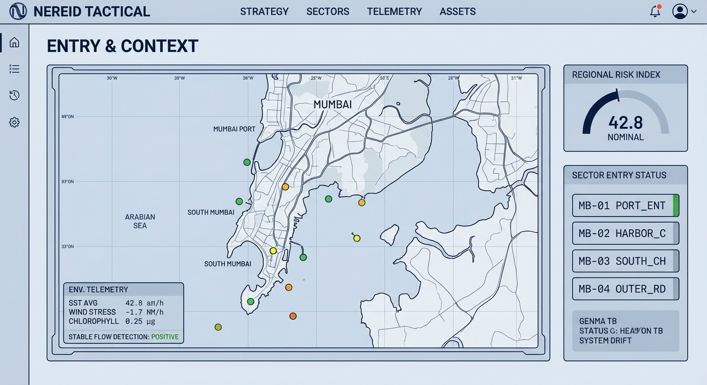
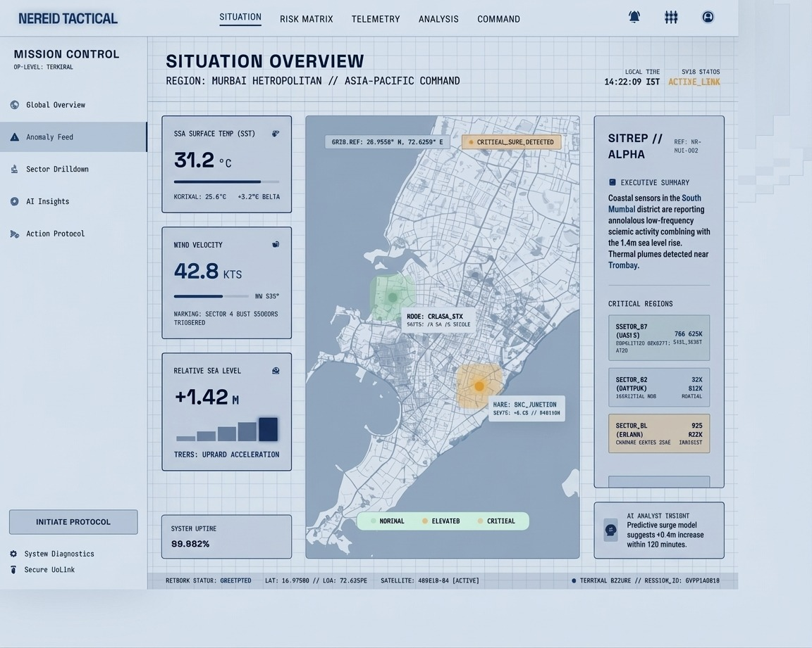
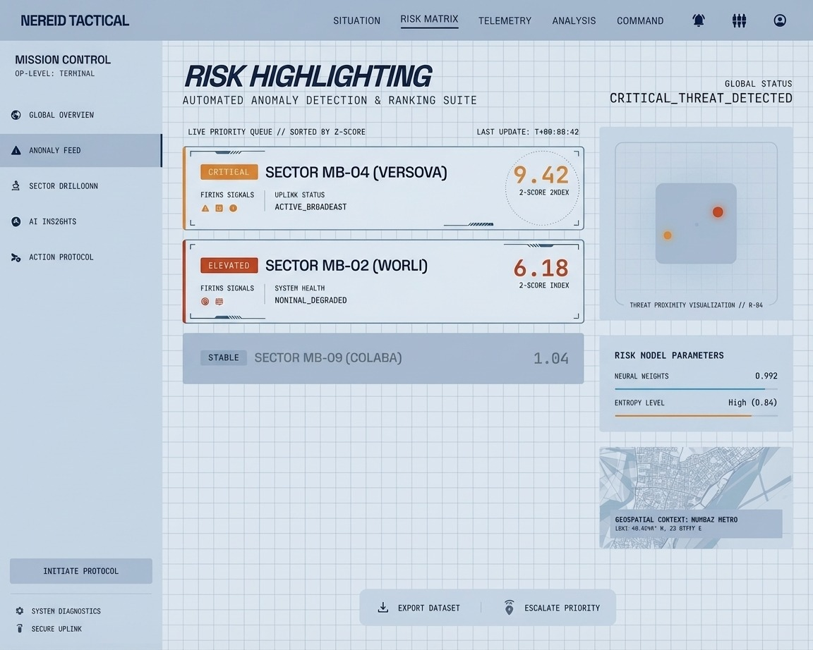
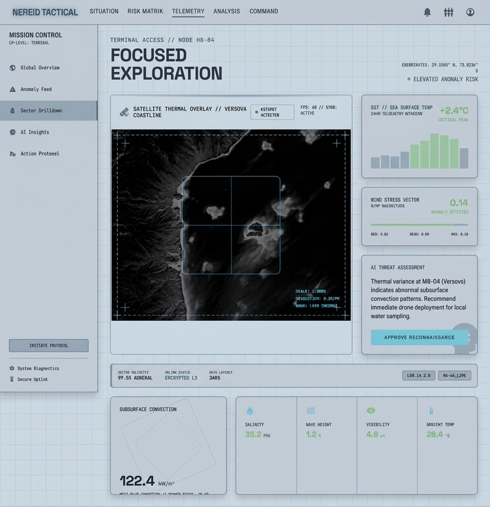

<div align="center">

  
  
  # 🌊 NEREID - Neural Environmental Risk Evaluation & Incident Detection
  
  ### *Tactical Marine Environmental Monitoring & Anomaly Detection*
  
  <p>
    
    
    
    
    
  </p>

</div>

<!-- Terminal Intro Animation -->
<div align="center">
  
</div>


## 🎯 Problem & Inspiration

<table>
<tr>
<td>

Marine ecosystems and coastal infrastructure face **critical threats** from subtle environmental shifts:

- 🔴 **Signal Overload** – Operators are drowned in raw sonar, thermal, and atmospheric metrics lacking context.
- 🔴 **Delayed Intelligence** – Processing data through cloud APIs incurs latency and risks data interception.
- 🔴 **Fragmented Threat Detection** – Identifying anomalies across overlapping variables (SST, Wind, Chlorophyll) is extremely difficult manually.
- 🔴 **Action Paralysis** – Lack of direct translation from data anomalies to clear tactical procedures.

**NEREID** solves these problems with a military-grade, fully offline intelligent dashboard that transforms raw marine telemetry into actionable, AI-narrated threat matrices.

</td>
<td width="35%">

### 🖥️ Tactical HUD Design
Engineered from the ground up to mimic a high-density, command-center interface.

### 🤖 Offline Agentic Execution
Locally hosted Models (Gemma3 via Ollama) ensure zero data leakage and total air-gapped readiness.

</td>
</tr>
</table>


## 📸 Dashboard Interface Highlights & Explanations

Here is a visual breakdown of the NEREID Tactical UI in action:

<div align="center">
  
### 1. Global Context & Entry Status

**Description:** The primary map interface. Shows live Sector Entry Statuses (like MB-01 PORT_ENT), real-time environmental telemetry (SST Avg, Wind Stress), and the aggregate Regional Risk Index. Map markers indicate dynamic anomaly severity across Mumbai's coastline.

### 2. Insight & Explanation Breakdown

**Description:** Detailed impact modeling triggered by a High-Risk Coastal Flooding event. Features local AI correlating abnormal SST (+3.80) with sustained wind patterns, rendering inundation probabilities (88%), and projecting critical infrastructure failure.

### 3. Tactical Fog Decision & Action Dashboard

**Description:** The action center. When a regional failure emerges (e.g., Zone Alpha-7 Impact Radius), this screen displays real-time protocol logs and active asset readiness. It provides immediate triggers to Initiate Regional Alerts, Notify Authorities, or Deploy Emergency Responses.

### 4. Automated Anomaly Detection Matrix

**Description:** A live priority queue sorting marine sectors by Z-Score Index. Distinguishes Critical (MB-04 Versova at 9.42) from Elevated (MB-02 Worli) threats, visualizing threat proximity and providing quick export and escalation paths.

</div>


## 🧠 What It Does

<div align="center">
  <table>
    <tr>
      <td align="center" width="200">
        <h3>📊</h3>
        <b>Z-Score Anomaly Engine</b>
        <br>Live statistical deviation detection
      </td>
      <td align="center" width="200">
        <h3>🌍</h3>
        <b>Tactical Map Overlays</b>
        <br>Real-time sector visual feedback
      </td>
      <td align="center" width="200">
        <h3>🤖</h3>
        <b>Local AI Narration</b>
        <br>Gemma3 threat translation
      </td>
    </tr>
    <tr>
      <td align="center" width="200">
        <h3>📈</h3>
        <b>Prophet Forecasting</b>
        <br>Baseline variance predictions
      </td>
      <td align="center" width="200">
        <h3>⚡</h3>
        <b>Signal Aggregation</b>
        <br>Multi-metric convergence
      </td>
      <td align="center" width="200">
        <h3>📋</h3>
        <b>Action Protocols</b>
        <br>Immediate response commands
      </td>
    </tr>
  </table>
</div>


## ⚙️ Tech Stack

<div align="center">

### 🖥️ Frontend (Tactical HUD)
⚛️ React • 📦 Vite • 🎨 Tailwind CSS • 🗺️ React-Leaflet  
📊 Recharts • 🌐 Axios • 💎 Glassmorphism UI 

### ⚙️ Backend (Data Engine)
🐍 Python 3.11 • ⚡ FastAPI • 🗄️ SQLite (aiosqlite)  
🔄 Pydantic Data Validation • ⏱️ Async Uvicorn Execution

### 🤖 AI / Machine Learning
🧠 Ollama (Gemma3:4b Engine) • 📈 Meta Prophet  
🔢 Scikit-Learn • 🧮 Numpy / Pandas • 🛡️ Z-Score Statistical Gates

</div>


## ✨ Core Features

### 🔍 Precision Convergence Detection
- **Multi-Sensor Baseline:** Synthesizes SST, Subsurface Convection, and Wind Stress simultaneously.
- **Dynamic Thresholding:** Uses rolling mean/std Z-Scores to avoid false positives.

### 🤖 Neural Copilot (Offline)
- **Zero-Latency Analysis:** Translates complex JSON arrays into clear tactical readouts.
- **Privacy First:** Model runs entirely locally via Ollama, preventing classified data leakage.
- **Context Awareness:** AI understands specific sector IDs and historical risk weights.

### 🎮 High-Density Command UI
- **Military Aesthetic:** Built to prioritize dark-mode data consumption.
- **Smooth Interaction:** Features sliding off-canvas telemetry panels, scanlines, and CSS radar beam overlays.


## 🏗️ System Architecture

```
┌─────────────────────────────────────────────────────────────────────────┐
│                          TACTICAL LAYER                                  │
│   ┌─────────────────────────────────────────────────────────────────┐   │
│   │               React / Vite Frontend Dashboard                   │   │
│   │  ┌──────────────┐  ┌──────────────┐  ┌──────────────┐          │   │
│   │  │ Sector Map   │  │ Alert Feed   │  │   Telemetry  │          │   │
│   │  └──────────────┘  └──────────────┘  └──────────────┘          │   │
│   │  ┌──────────────┐  ┌──────────────┐                            │   │
│   │  │ Neural Chat  │  │ Charting UI  │                            │   │
│   │  └──────────────┘  └──────────────┘                            │   │
│   └─────────────────────────────────────────────────────────────────┘   │
│                                    │ Async API (Axios)                   │
└────────────────────────────────────┼─────────────────────────────────────┘
                                     │
┌────────────────────────────────────┼─────────────────────────────────────┐
│                          DECISION LAYER                                   │
│         ┌──────────────────────────┴──────────────────────┐              │
│         │              FastAPI Backend Servers            │              │
│         │  ┌────────────────────────────────────────────┐ │              │
│         │  │ Routes: Scorer, Zones, Signals, Queries    │ │              │
│         │  └────────────────────────────────────────────┘ │              │
│         └──────────────────────────┬──────────────────────┘              │
└────────────────────────────────────┼─────────────────────────────────────┘
                                     │
          ┌──────────────────────────┼──────────────────────────┐
          │                          │                          │
          ▼                          ▼                          ▼
┌──────────────────┐     ┌──────────────────┐      ┌──────────────────┐
│   ML Pipeline    │     │      Local       │      │   Time-Series    │
│    (Python)      │     │     Database     │      │     Forecasting  │
│ ┌──────────────┐ │     │ ┌──────────────┐ │      │ ┌──────────────┐ │
│ │ Z-Score      │ │     │ │ SQLite (DB)  │ │      │ │  Meta Prophet│ │
│ │ Convergence  │ │     │ │ Zones / Feed │ │      │ │  Scikit      │ │
│ └──────────────┘ │     │ └──────────────┘ │      │ └──────────────┘ │
└──────────────────┘     └──────────────────┘      └──────────────────┘
          │
          ▼
┌──────────────────┐
│ Offline AI Shell │
│ (Ollama)         │
│ Gemma3 Inference │
└──────────────────┘
```


## 🚀 Quick Start Guide

### Prerequisites
```bash
Node.js v18+
Python 3.11+
Ollama Engine (Local)
```

### 1️⃣ Clone the Repository
```bash
git clone <your-repo-url>
cd airavat
```

### 2️⃣ Start Local AI Services
```bash
# Install Ollama and pull model
ollama pull gemma3:4b
ollama serve
```

### 3️⃣ Backend Setup
```bash
cd backend
pip install -r requirements.txt

# Run initial forecasting tests
python test_prophet.py

# Start Backend Server
uvicorn main:app --reload --port 8000
```

### 4️⃣ Frontend Application
```bash
cd frontend
npm install
npm run dev
```

Navigate to **`http://localhost:5173`** to enter the NEREID Command Center.


## 🔌 API Endpoints (Core)

| Method | Endpoint | Description |
|--------|----------|-------------|
| GET | `/api/zones` | Retrieve all active marine sectors |
| GET | `/api/zones/{zone_id}/telemetry` | Fetch historical signal arrays |
| GET | `/api/alerts/active` | Get highest priority anomaly alerts |
| POST | `/api/ai/query` | Prompt local Gemma3 for narration |


## 🧪 AI Integration Example

NEREID translates raw mathematical anomalies into tactical narratives:

### Input (Raw JSON from Z-Score convergence)
```json
{
  "zone": "MB-04",
  "sst_deviation": 3.82,
  "wind_stress_spike": true,
  "chlorophyll_drop": 0.14
}
```

### Output (Ollama Generation via Prompt)
```text
"CRITICAL THREAT DETECTED: Sector MB-04 (Versova) is exhibiting severe thermohaline disruption. The correlation between abnormal SST (+3.82z) and sustained wind stress indicates an extreme risk of localized coastal infrastructure flooding. Confidence 94.2%. Recommend immediate deployment of reconnaissance drones and possible initiation of Coastal Alert Protocol 07-X."
```


## 🗺️ Roadmap

- ✅ **Phase 1**: Tactical Glassmorphism Layout
- ✅ **Phase 2**: Prophet Baseline Time-Series modeling
- ✅ **Phase 3**: Local AI Narration via Ollama
- 🔄 **Phase 4**: Sonar/LIDAR Data Integration Modules
- 📅 **Phase 5**: Multi-Region Sector Expansion
- 📅 **Phase 6**: Secure WebSockets for sub-second updates


## 👥 Meet Team

<div align="center">
  <table>
    <tr>
      <td align="center">
        <b>🌊 Airborne Surveillance & Oceanography Control</b>
        <br>
        Engineering secure, scalable, predictive environments.
      </td>
    </tr>
  </table>
</div>

---

<div align="center">
  <sub>Built with ❤️ for Global Hackathon Teams</sub>
  <br>
  <sub>Safeguarding marine ecosystems through intelligence</sub>
</div>


